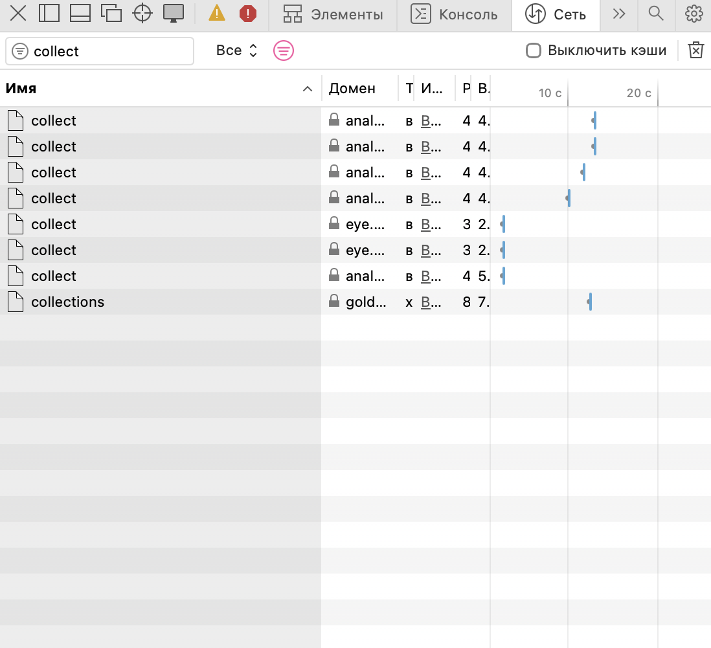

# Домашняя работа № 1 · Путь данных от ссылки до заявки

**Дисциплина:** ОП.03 «Информационные технологии»

| Поле | Значение |
|---|---|
| ФИО |Кононова Ника Антоновна|
| Группа |РПО  |
|  |  |3
| Тема работы | Цифровая воронка: путь данных от ссылки до заявки |
| - |  |
| Ветка | `hw-01` |

---

## Задание

1. Открыть сайт, панель разработчика (F12) → **Network**, в фильтре `collect`,
   галочка **Preserve log**.
2. Сделать три действия: обновить страницу, прокрутить до низа, нажать
   на товар. Записать, какие события ушли — параметр `en` на вкладке **Payload**.
3. Описать путь пользователя от ссылки до заявки, пять шагов.
4. Найти одно место на этом пути, где данные могут потеряться.
5. Приложить скриншоты `screens/01-network.png` и `screens/02-payload.png`.

Сайт: https://shop.merch.google/, запасные — https://habr.com/ru/,
https://www.smashingmagazine.com/, https://css-tricks.com/. Открывать
в Chrome или Edge с выключенным блокировщиком рекламы.

Срок — до начала занятия 2. Ветка `hw-01`, запрос на слияние в свою `main`.

---

## 1. Какой сайт смотрел

| Поле | Значение |
|---|---|
|  |  |
| Адрес | Золотое яблоко |
| Откуда сайт | https://goldapple.ru/?srsltid=AU7gw4UYC7HshbjhkiU529c0NS0-QstBSlmVgMGQPO3L0QW9KguMlKys |

## 2. Три действия и что отправил счётчик

Панель Network, фильтр `collect`, галочка Preserve log. Название события
лежит в параметре `en` на вкладке Payload.

В первой строке стоит пример. **Удалите его** и впишите свои три.

| № | Что я сделал на сайте | Название события (`en`) | Что ещё было в Payload |
|---|---|---|---|
| 1 | перешла на товар | *` page_view`* | *`dl`,  https://goldapple.ru/99000059940-lip-trio-maximazer* |
| 2 | перешла в корзину | *`add_to_cart`* | *`dl`, https://goldapple.ru/for-action/dlja-pervyh-holodov/uhod?promos=1* |
| 3 | удалила товар из корзины | *` remove_from_cart`*  | *`dl`, https://goldapple.ru/brands* |

Скриншоты:

Скриншот: вставьте строку 

Скриншот: вставьте строку ``

## 3. Путь пользователя: 5 шагов

От ссылки до заявки, своими словами. Панель для этого не нужна: это рассказ
о том, как человек доходит до кнопки «Отправить». В правом столбце стоит
пример, в левом вы пишете свой вариант.

| № | Мой шаг | Пример |
|---|---|---|
| 1 |  | *человек увидел ссылку в сообществе и нажал на неё* |
| 2 |  | *открылась главная страница сайта* |
| 3 |  | *он прокрутил до формы записи* |
| 4 |  | *начал заполнять: имя и телефон* |
| 5 |  | *нажал «Отправить», заявка ушла менеджеру* |

## 4. Где данные могут потеряться

В первой строке стоит пример, **удалите его**. Строку 1 заполняют все,
строку 2 заполняйте по желанию.

| № | На каком шаге | Что может потеряться |
|---|---|---|
| — | *шаг 1, переход по ссылке* | *в ссылке нет метки, и в заявке не видно, откуда пришёл человек* |
| 1 |  |  |
| 2 | *(по желанию)* |  |

## 5. Использование ИИ

| Вопрос | Ответ |
|---|---|
| Что сделал сам |  |
| Что спросил у модели |  |
| Что после этого изменил |  |