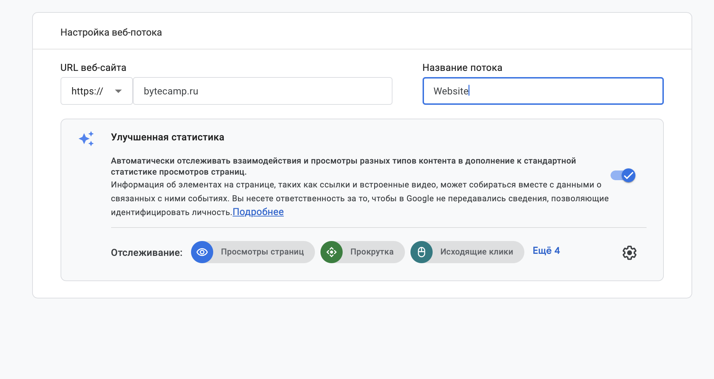
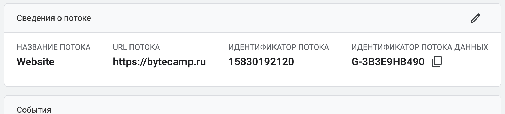

# Задание 2 · Где бизнес теряет клиентов: анализ воронки цифрового продукта

Цель работы — провести самостоятельное исследование пользовательской и маркетинговой воронки, найти подтверждения в реальных источниках и кейсах российского рынка, сформулировать собственные выводы, а также создать структуру Google Analytics 4 по презентации.

## Часть 1. Исследование воронки

**1. Составление воронки**

«ЗОЛОТОЕ ЯБЛОКО» магазин парфюмерии и косметики

| Этап | Что считается переходом | Метрика, которая помогает оценить результат |
|-|-|-|
| **Реклама товара**<br><br>Пользователя привлекла реклама товара, он хочет узнать или купить продукт | Нажатие на рекламу | CPC (стоимость одного клика); CTR (показатель кликабельности) |
| **Переход на сайт**<br><br>Пользователь попадает на главную страницу | Просмотр нескольких (каталог, карточки), использует поиск товара, читает отзывы | Bounce Rate (должен быть низким, чем быстрее тем больше заинтересован пользователь) |
| **Просмотр карточки товара**<br><br>Пользователь изучает товар, его цену, фото, описание, состав, отзывы покупателей, проверка наличия в магазинах города | Нажатие «Добавить в корзину» | PDP Add-to-Cart |
| **Корзина**<br><br>Пользователь может перейти к оформлению или к выбору других товаров | Нажатие «Оформить заказ» | Cart-to-Checkout Rate |
| **Оформление заказа**<br><br>Данные покупателя, выбор способа доставки (курьер, самовывоз), способ оплаты | Успешное проверка данных после нажатие «Подтвердить заказ» | Checkout Conversion Rate, Error Rate (ошибки ввода) |
| **Оплата**<br><br>Проведение платежа банковской картой онлайн СБП, или оплата картой офлайн при получении | Статус платежа SUCCESS (оплата прошла успешно) | Payment Success Rate (успешность оплат), AOV (Average Order Value — средний чек) |

### ИСТОЧНИКИ

**1.** «Исследование ключевых показателей интернет-рекламы: сравниваем 2-е кварталы 2025 и 2026 годов», Павел Иванов, 09 июля 2026

``` https://blog.click.ru/analytics/issledovanie-klyuchevyh-pokazateley-internet-reklamy/ ```

**Фрагмент** <br>
Кликабельность объявлений (CTR) — один из ключевых индикаторов соответствия рекламных площадок для бизнеса. Рост или стабильность этого показателя говорит о развитии инструментов таргетинга, улучшении качества трафика и повышении интереса аудитории к рекламным сообщениям. Средний CTR по всем площадкам вырос на 11,72% <br>

В статье говорится о том, что реклама влияет на кликабельность, но, чтобы её увидели нужно платить больше. Это относится к 1 этапу моей воронки. Чем лучше реклама, тем больше людей перейдет на сайт, и кто-то из них захочет купить товар.

**2.** «Маркетинговые воронки в e-commerce: как омниканальность меняет поведение покупателей», Владислав Исайко, 15 марта 2025 года

``` https://vk.ru/wall-220453141_2107 ```

**Фрагмент**<br>
«На решение о покупке косметики наибольшее влияние оказали социальные сети и инфлюенсеры. 33% опрошенных, купивших косметику, узнали о продукте через рекламу в социальных сетях». 25% приобрели товары в мобильных приложениях, так как увидели там персонализированные рекомендации. Email-рассылки также сыграли свою роль: 21% респондентов сообщили, что купили косметику, получив персонализированные предложения по электронной почте». «Для пользователей, которые взаимодействовали с бизнесом через три канала (мобильные приложения, сайты и email-рассылки), коэффициент конверсии составил 60%». <br>

Статья подтверждает, что реклама товара очень важна. Нужно удержать пользователя, отслуживать его на разных каналах (узнавать его везде: если человек положил товар в корзину на сайте с компьютера, мобильное приложение должно помнить об этом, в письме-напоминание тот же товар, который он выбрал. В моей воронке это этапы: реклама, карточка товара, корзина.

**3.** «Воронка продаж: этапы построения и анализ эффективности», Cветлана Бабичева, 27 марта 2025 г.

```https://sberbusiness.live/publications/voronka-prodazh?ysclid=mua8ve84wj136749227```

**Фрагмент**<br>
«Дизайн-агентство Turum-burum обнаружило, что CTA на продуктовых страницах часто оставалось незамеченным. После оптимизации конверсия в оформление услуги выросла на 36%». <br>

Когда пользователь находится на карточке товара он может не найти кнопку добавления в корзину и покупки не будет. Если сделать кнопку более удобной и видимой, то количество брошенных корзин сократится. Это относится к этапу карточка товара.

**4.** «Брошенная корзина: как вернуть потерянные продажи на маркетплейсах» От иголки до слона, 06.05.2026

```https://o-ff.ru/blog/post/broshennaya-korzina-abandoned-cart-na-marketplejsah-chto-eto-i-kak-snizit-procent-nevykupov-slovar-sellera?ysclid=muabgs5b9p246762157```

**Фрагмент**<br>
«Почему покупатели бросают корзину на маркетплейсах. Выделяют несколько основных причин. Неожиданно высокая стоимость доставки (48%). Обязательная регистрация перед покупкой (24%). Слишком долгий или сложный процесс оформления (22%). Недоверие к сайту - нет ощущения безопасности (18%). Сайт дал ошибку или завис (17%). Долгая доставка или отсутствие удобного ПВЗ». <br>

Брошенная корзина - главное узкое место воронки e-commerce: покупатели, добавивших товар в корзину, уходят без покупки. Это напрямую относится к этапу Корзина и этапу оформление заказа. Нужно отслеживать, упрощать оформление, добавлять СБП, убирать лишние поля, возвращать клиентов через триггерные рассылки.

**5.** «Воронка продаж для аналитика: как считать конверсии и находить узкие места в продукте», HireHi 27 декабря год

```https://hirehi.ru/blog/voronka-prodazh-dlia-analitika-kak-schitat-konversii-i-nakhodit-uzkie-mesta-v-produkte```

**Фрагмент**<br>
«Для интернет-мага годзинов используется специфическая воронка checkout: просмотр каталога, просмотр карточки товара, добавление в корзину, переход к оформлению, ввод данных доставки, выбор способа оплаты, подтверждение заказа, успешная оплата. Каждый этап можно и нужно декомпозировать дальше. Например, «ввод данных доставки» можно разбить на: заполнение имени, заполнение адреса, выбор способа доставки. Такая детализация позволяет находить микропроблемы в интерфейсе» <br>

Реклама: важно не просто получить клик, а удержать человека — чтобы он остался на сайте и начал что-то делать. Переход на сайт: нужен не просто посетитель, а тот, кто совершает действия - смотрит товары или ищет нужное. Оформление заказа: разбить на разные шаги: адрес → доставка → оплата. Так можно увидеть, где именно человек остановился (из-за цены доставки, неудобный ПВЗ).

**6.** «Будущее e-commerce: тренды интернет-торговли в 2025 году», Алекс Зимин, 1 марта 2025 г.

```https://www.shopmanager.by/blog/2025/03/e-commerce-2025/```

**Фрагмент**<br>
«По статистике, уже более 70% онлайн-покупок совершаются с мобильных устройств, а в некоторых странах этот показатель еще выше. Это вынуждает компании уделять больше внимания мобильным версиям сайтов и приложениям, оптимизируя их под удобство пользователей». <br>

Продажи через интернет будут расти. Нужно сделать так, чтобы клиент не терялся даже на самом входе в воронке. Человек нажал на рекламу – сайт должен быстро открыться, меню должно быть понятным, сделать удобные фильтры, чтобы человек не путался в ассортименте, а сразу находил то, за чем пришёл.

**7.** «Онлайн наводит красоту», Виктория Колганова, 04.04.2026

```https://www.kommersant.ru/doc/8588377```

**Фрагмент**<br>
«В январе-феврале 2026 года продажи товаров для красоты и здоровья в российском сегменте e-commerce увеличились на 16,5% год к году, до 91,3 млрд руб. Средний чек в категории на внутреннем рынке по итогам января-февраля вырос на 16,1% к концу 2025 года, составив около 3,6 тыс. руб. Как отметили в "Золотом яблоке", в 2025 году доля онлайн-продаж сети превысила 60%, увеличившись примерно на 10 процентных пунктов год к году».<br>

Реальные показатели «Золотого яблока». Средний чек 3,6 тыс. руб., 60% - онлайн-продажи. Прибыль выросла в два раза при росте выручки всего на треть. Выгодно улучшать воронку, чтобы больше людей доходило до покупки.

### 2. Два реальных кейса российских компаний

| Компания | Authentica.love онлайн-бутик бьюти-брендов | EveLux Professional косметика для волос (продажи на озон WB) |
|-|-|-|
| Как выглядела рассматриваемая воронка или её проблемный участок | Корзина -> Оформление -> Оплата<br><br>Проблемный участок: любой переход между этапами воронки | Реклама в VK -> Переход на карточку товара (Озон) -> Добавление в корзину -> поиск товара на WB -> Покупка на WB<br><br>Проблемный участок: После просмотра карточки товара |
| В чём заключалась проблема | Много пользователей, которые добавляли товары в корзину, но не завершали покупку (могли отвлечься на другую рекламу, забыли о товарах). Магазин не реагировал никак | Реклама товара на Озоне, а продажи на WB. UTM-метка показывала 0 продаж с рекламы |
| Какие данные или наблюдения подтвердили проблему | Люди бросали корзины не потому, что сайт вис, а потому, что отвлеклись на что-то другое или потеряли интерес к товару | Запустив рекламу на Ozon, команда увидела, что в тот же период выросли продажи на WB. Пользователи кликали по рекламе, переходили на карточку Ozon, а потом вручную искали тот же товар на WB (дешевле или там привычнее делать покупки) |
| Что компания изменила или протестировала | Настроили автоматическую триггерную рассылку из трёх писем для тех, кто бросил корзину: первое письмо — через 2 часа, второе - через 2 дня, третье - ещё через 2 дня. В письмах напоминали про товары и мотивировали вернуться | Перестали ориентироваться на UTM-метки (ориентир на данные продаж в кабинете маркетплейса). Проводили тестирование связок для каждого товара (Товар + Площадка + Реклама») Один и тот же крем может продаваться через рекламу в ВКонтакте, но не продаваться на другой площадке. Отключили неэффективную рекламу. Улучшили карточки товаров на маркетплейсах |
| Как изменился результат, если компания опубликовала показатели | Увеличили заказы на 9%. За 3 месяца сделано 138 заказов и 1,1 млн рублей выручки, которые могли бы быть потеряны | Более 6 800 продаж, отдельные товары (например, двухшаговую маску) стали главными драйверами выручки |
| Ваш вывод: можно ли перенести этот подход на выбранный вами объект исследования | Можно полностью перенести на Золотое яблоко. Рассылка триггерных писем напомнит людям о выбранных товарах и сможет повысить продажи, тем более что цены в Золотом яблоке ниже, чем у элитной косметики | Можно перенести частично на Золотое яблоко: тестирование связок (Канал - Товар); быстро отключать неэффективные рекламы. Контролировать по UTM-метке нет возможности (Золотое яблоко имеет сайт + приложение + магазины) системе сложно понять откуда пришла покупка |

### ССЫЛКИ

**Authentica.love** <br>
«Кейс онлайн-бутика Authentica.love: заработали 5,3 млн рублей за 3 месяца с помощью поп-апов и триггерных email-рассылок»

```https://www.carrotquest.io/blog/authenticalove-case/?ysclid=mub76t94b7863720```

«Возвращение клиентов способно увеличить продажи: от 15 до 40 и более процентов — правда или миф»

```https://sendsay.ru/blog/vozvraschat-klientov-prosche-chem-kazhetsya/?ysclid=mub7hq09v121837904```

**EveLux Professional** <br>
«VK AdBlogger и VK ADS для селлера: 6800+ продаж косметики на WB и Ozon»

```https://blog.xn--90aha1bhc1b.xn--p1ai/kejs-adblogger-i-vk-ads-6800-prodazh-dlya-magazina-kosmetiki-na-wb-i-ozon?ysclid=mub8pucw2d851455804```

```https://vk.ru/wall-169082969_1411?ysclid=mub97bhe3j372464868```

### 3. На основании найденных материалов:

**Причина 1. Слишком большой выбор товаров (Карточка товара)**<br>
Пользователю трудно выбрать товар из множества представленных в каталоге (например, трудно подобрать нужный оттенок помады, румян). Поэтому пользователь уходит с сайта.

**Причина 2. Не то, что было в рекламе (Переход на сайт)** <br>
Пользователь посмотрел рекламу и захотел купить товар. Он перешел на сайт, но сайт либо долго грузится, либо товар отсутствует. Тогда он сразу закроет вкладку.

**Причина 3. Стоимость товара (Корзина -> Оформление)**<br>
Брошенная корзина из-за высокой цены, дорогой доставки, неудобного оформления заказа. Покупатель может отложить покупку, чтобы дождаться скидки или посмотреть в другом месте. Многие используют корзину как список желаемого.

**Причина 4. Сложности при оформлении (Корзина -> Оформление).**<br>
Сложное оформление с регистрацией и множеством полей. Для пользователей это неудобно, они просто бросают корзину.

### Сформулировать минимум 3 собственные гипотезы улучшения воронки.

Для каждой гипотезы указать, какие данные необходимо собрать и как проверить, сработало изменение или нет.

| Гипотезы | Какие данные необходимо собрать и как проверить, сработали изменение или нет |
|-|-|
| **Гипотеза 1**<br><br>Внедрение на карточку товара интерактивного подбора нужного оттенка (Try-On) повысит добавление товара в корзину | **Данные:**<br>• PDP View-to-Add-to-Cart Rate до внедрения виртуального подбора и после;<br>• время на карточке товара (Engagement Rate);<br>• Bounce Rate с карточек этих категорий.<br><br>**Проверка:**<br>На карточке товара (помада) пользователь нажимает кнопку «Примерить» или «Попробовать на себе». Нейросеть распознаёт черты лица (губы, скулы, тон кожи) и накладывает на них выбранный оттенок продукта. Посмотреть какая доля пользователей, запустивших Тry on<br><br>**Сработало или нет:**<br>Если Add-to-Cart Rate растет, то сработало. |
| **Гипотеза 2**<br><br>Чем меньше нужно оформлять, тем выше вероятность покупки | **Данные:**<br>• Checkout Abandonment Rate (показатель начали оформлять и не закончили);<br>• Error Rate (ошибки ввода);<br>• среднее время оформления заказа (Яндекс.Метрика, Google Analytics 4)<br><br>**Проверка:** Одни пользователи используют полную форму оформления заказа. Другие - заполняют упрощённую форму оформления заявки.<br><br>**Сработало или нет:**<br>Если сработало, то во второй группе будет снижение Abandonment Rate (отказ, прерывание). А Checkout Conversion Rate (успешное завершение) будет увеличиваться. |
| **Гипотеза 3**<br><br>Внедрение триггерной рассылки для брошенных корзин увеличит возвращение покупателей к корзине и увеличит покупки | **Данные:**<br>• Cart-to-Checkout Rate для брошенных корзин до и после запуска;<br>• Recovery Rate (доля вернувшихся и завершивших покупку);<br>• выручка, восстановленная через рассылку;<br>• количество отписок от e-mail писем;<br><br>**Проверка:**<br>Две группы. Одной группе рассылают триггерные письма с пометкой UTM-меткой, чтобы отследить возврат и покупку. Другой нет.<br><br>**Сработает или нет:**<br>Если начался рост заказов от брошенных корзин от группы которой рассылали письма, то гипотеза сработала.<br>Если началась массовая отписка от рассылок, то не сработало. |

# Часть 2. Google Analytics 4
## 1. Создание Analytics Account
 **Название аккаунта:** educationalProject_Nika
 **Скриншот:** `screens/01-analytics-account.png`

## 2. Создание Property (Ресурса)
**Название ресурса:** educationalProject
**Часовой пояс:** (GMT+03:00) Moca
**Валюта:** RUB (₽)
**Скриншот:** `screens/02-property.png`

## 3. Выбор бизнес-целей
**Выбранные цели:** Анализ трафика сайта и/или приложения
**Скриншот:** `screens/03-business-goals.png`

## 4. Создание Web Data Stream
**Website URL:** http://bytecamp.ru
**Stream name:** Website


## 5. Получение Measurement ID

- **Measurement ID:** G-3B3E9HB490
