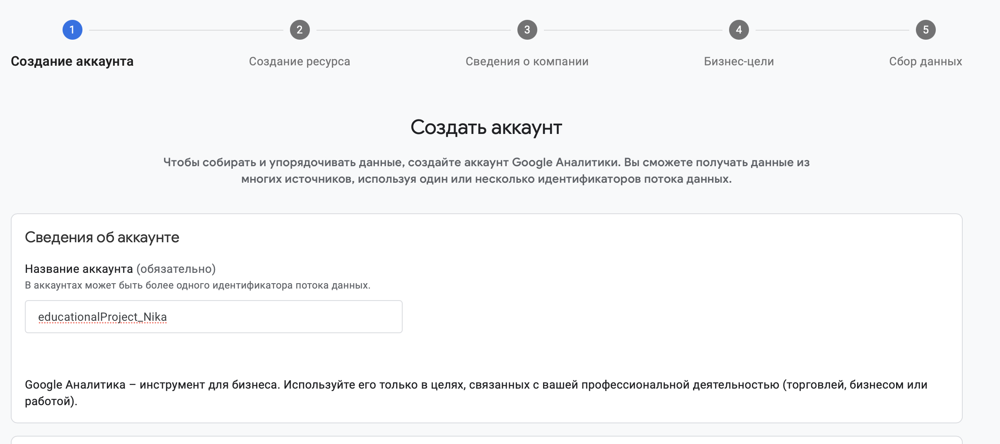
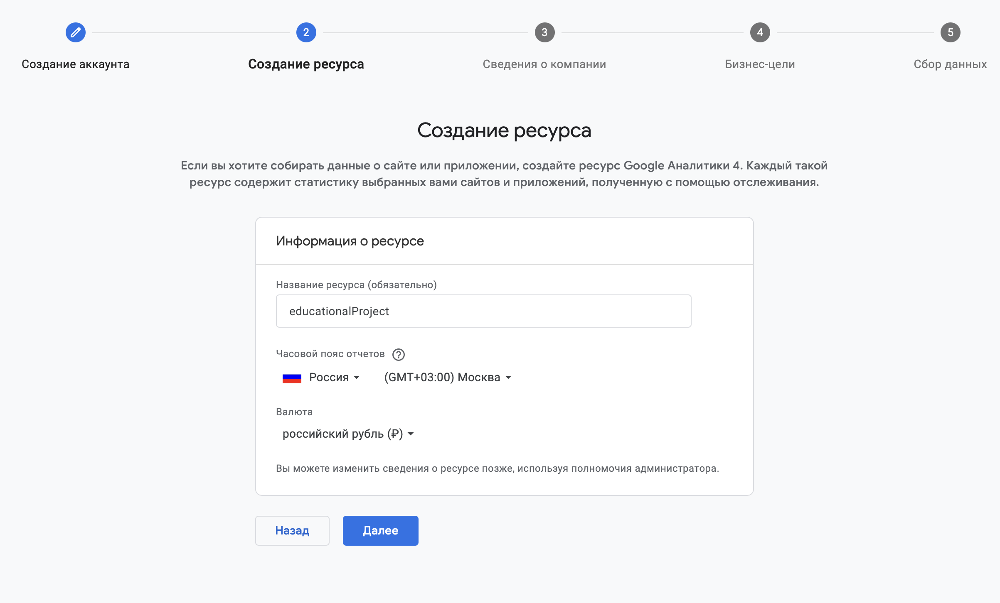
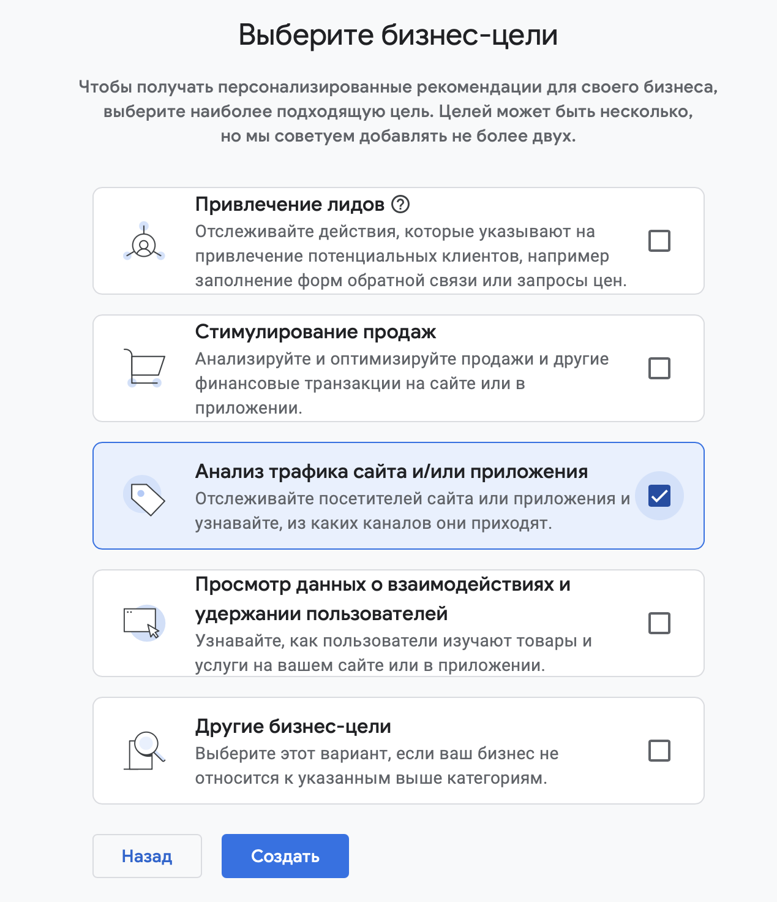

# Домашняя работа № 2 · Где бизнес теряет клиентов

**Дисциплина:** ОП.03 «Информационные технологии»

| Поле | Значение |
|---|---|
| Фамилия, имя, отчество | Кононова Ника Антоновна |
| Группа | РПО3 |
| Номер работы | 2 |
| Тема работы | Анализ воронки цифрового продукта и структура Google Analytics 4 |
| Дата сдачи | 25.09 |
| Ветка | `hw-02` |

---

# Часть 1. Исследование воронки

## 1.1. Объект исследования

| Поле | Значение |
|---|---|
| Компания, сервис или отрасль | «ЗОЛОТОЕ ЯБЛОКО» магазин парфюмерии и косметики |
| Адрес сайта или приложения | https://goldapple.ru/?srsltid=AU7gw4We_4Q7E0hCxWxb_O3fxT0_HF9TvVBD6kF9h5g0lXEB1klEq4il |
| Целевое действие | Успешная оплата заказа — проведение платежа банковской картой онлайн через СБП или оплата картой офлайн при получении |
| Почему выбран этот объект | «Золотое Яблоко» один из самых больших магазинов косметики в России. У него есть магазин, сайт и приложение.  Самые разные товары: дорогие и дешевые. Интересно было выяснить почему при таком разнообразии товаров и  цен некоторые покупатели просто смотрят товар и уходят в другие магазины.  Также интересно где именно теряется покупатель. |

## 1.2. Воронка

От 4 до 7 этапов, по порядку.

| Этап | Что считается переходом | Метрика, которая помогает оценить результат |
|-|-|-|
| **Реклама товара**  Пользователя привлекла реклама товара, он хочет узнать или купить продукт | Нажатие на рекламу | CPC (стоимость одного клика); CTR (показатель кликабельности) |
| **Переход на сайт**  Пользователь попадает на главную страницу | Просмотр нескольких (каталог, карточки), использует поиск товара, читает отзывы | Bounce Rate (должен быть низким, чем быстрее тем больше заинтересован пользователь) |
| **Просмотр карточки товара**  Пользователь изучает товар, его цену, фото, описание, состав, отзывы покупателей, проверка наличия в магазинах города | Нажатие «Добавить в корзину» | PDP Add-to-Cart |
| **Корзина**  Пользователь может перейти к оформлению или к выбору других товаров | Нажатие «Оформить заказ» | Cart-to-Checkout Rate |
| **Оформление заказа**  Данные покупателя, выбор способа доставки (курьер, самовывоз), способ оплаты | Успешное проверка данных после нажатие «Подтвердить заказ» | Checkout Conversion Rate, Error Rate (ошибки ввода) |
| **Оплата**  Проведение платежа банковской картой онлайн СБП, или оплата картой офлайн при получении | Статус платежа SUCCESS (оплата прошла успешно) | Payment Success Rate (успешность оплат), AOV (Average Order Value — средний чек) |

## 1.3. Источники

Не менее пяти. Каждый разбирается по пяти пунктам.

### Источник 1

| Поле | Значение |
|---|---|
| Название материала | «Исследование ключевых показателей интернет-рекламы: сравниваем 2-е кварталы 2025 и 2026 годов» |
| Автор или организация | Павел Иванов |
| Дата публикации | 09 июля 2026 |
| Прямая ссылка | https://blog.click.ru/analytics/issledovanie-klyuchevyh-pokazateley-internet-reklamy/ |

**Выписка из материала** (ключевая мысль, цифра, наблюдение, результат):

> Кликабельность объявлений (CTR) — один из ключевых индикаторов соответствия рекламных площадок для бизнеса. Рост или стабильность этого показателя говорит о развитии инструментов таргетинга, улучшении качества трафика и повышении интереса аудитории к рекламным сообщениям. Средний CTR по всем площадкам вырос на 11,72%

**Что подтверждает и как связано с моей воронкой** (своими словами):

> В статье говорится о том, что реклама влияет на кликабельность, но, чтобы её увидели нужно платить больше. Это относится к 1 этапу моей воронки. Чем лучше реклама, тем больше людей перейдет на сайт, и кто-то из них захочет купить товар.

**Цифры из источника и этап воронки, к которому относятся:**

> Средний CTR по всем площадкам вырос на 11,72% — этап «Реклама товара».

### Источник 2

| Поле | Значение |
|---|---|
| Название материала | «Маркетинговые воронки в e-commerce: как омниканальность меняет поведение покупателей» |
| Автор или организация | Владислав Исайко |
| Дата публикации | 15 марта 2025 года |
| Прямая ссылка | https://vk.ru/wall-220453141_2107 |

**Выписка из материала:**

> «На решение о покупке косметики наибольшее влияние оказали социальные сети и инфлюенсеры. 33% опрошенных, купивших косметику, узнали о продукте через рекламу в социальных сетях». 25% приобрели товары в мобильных приложениях, так как увидели там персонализированные рекомендации. Email-рассылки также сыграли свою роль: 21% респондентов сообщили, что купили косметику, получив персонализированные предложения по электронной почте». «Для пользователей, которые взаимодействовали с бизнесом через три канала (мобильные приложения, сайты и email-рассылки), коэффициент конверсии составил 60%».

**Что подтверждает и как связано с моей воронкой:**

> Статья подтверждает, что реклама товара очень важна. Нужно удержать пользователя, отслуживать его на разных каналах (узнавать его везде: если человек положил товар в корзину на сайте с компьютера, мобильное приложение должно помнить об этом, в письме-напоминание тот же товар, который он выбрал. В моей воронке это этапы: реклама, карточка товара, корзина.

**Цифры из источника и этап воронки:**

> 33% узнали о продукте через рекламу в соцсетях; 25% купили в мобильных приложениях; 21% — по email; 60% конверсия при взаимодействии через три канала — этапы «Реклама товара», «Просмотр карточки товара», «Корзина».

### Источник 3

| Поле | Значение |
|---|---|
| Название материала | «Воронка продаж: этапы построения и анализ эффективности» |
| Автор или организация | Cветлана Бабичева |
| Дата публикации | 27 марта 2025 г. |
| Прямая ссылка | https://sberbusiness.live/publications/voronka-prodazh?ysclid=mua8ve84wj136749227 |

**Выписка из материала:**

> «Дизайн-агентство Turum-burum обнаружило, что CTA на продуктовых страницах часто оставалось незамеченным. После оптимизации конверсия в оформление услуги выросла на 36%».

**Что подтверждает и как связано с моей воронкой:**

> Когда пользователь находится на карточке товара он может не найти кнопку добавления в корзину и покупки не будет. Если сделать кнопку более удобной и видимой, то количество брошенных корзин сократится. Это относится к этапу карточка товара.

**Цифры из источника и этап воронки:**

> Конверсия в оформление услуги выросла на 36% — этап «Просмотр карточки товара».

### Источник 4

| Поле | Значение |
|---|---|
| Название материала | «Брошенная корзина: как вернуть потерянные продажи на маркетплейсах» |
| Автор или организация | От иголки до слона |
| Дата публикации | 06.05.2026 |
| Прямая ссылка | https://o-ff.ru/blog/post/broshennaya-korzina-abandoned-cart-na-marketplejsah-chto-eto-i-kak-snizit-procent-nevykupov-slovar-sellera?ysclid=muabgs5b9p246762157 |

**Выписка из материала:**

> «Почему покупатели бросают корзину на маркетплейсах. Выделяют несколько основных причин. Неожиданно высокая стоимость доставки (48%). Обязательная регистрация перед покупкой (24%). Слишком долгий или сложный процесс оформления (22%). Недоверие к сайту - нет ощущения безопасности (18%). Сайт дал ошибку или завис (17%). Долгая доставка или отсутствие удобного ПВЗ».

**Что подтверждает и как связано с моей воронкой:**

> Брошенная корзина - главное узкое место воронки e-commerce: покупатели, добавивших товар в корзину, уходят без покупки. Это напрямую относится к этапу Корзина и этапу оформление заказа. Нужно отслеживать, упрощать оформление, добавлять СБП, убирать лишние поля, возвращать клиентов через триггерные рассылки.

**Цифры из источника и этап воронки:**

> 48% — высокая стоимость доставки; 24% — обязательная регистрация; 22% — сложное оформление; 18% — недоверие к сайту; 17% — ошибки/зависания — этапы «Корзина», «Оформление заказа».

### Источник 5

| Поле | Значение |
|---|---|
| Название материала | «Воронка продаж для аналитика: как считать конверсии и находить узкие места в продукте» |
| Автор или организация | HireHi |
| Дата публикации | 27 декабря |
| Прямая ссылка | https://hirehi.ru/blog/voronka-prodazh-dlia-analitika-kak-schitat-konversii-i-nakhodit-uzkie-mesta-v-produkte |

**Выписка из материала:**

> «Для интернет-мага годзинов используется специфическая воронка checkout: просмотр каталога, просмотр карточки товара, добавление в корзину, переход к оформлению, ввод данных доставки, выбор способа оплаты, подтверждение заказа, успешная оплата. Каждый этап можно и нужно декомпозировать дальше. Например, «ввод данных доставки» можно разбить на: заполнение имени, заполнение адреса, выбор способа доставки. Такая детализация позволяет находить микропроблемы в интерфейсе»

**Что подтверждает и как связано с моей воронкой:**

> Реклама: важно не просто получить клик, а удержать человека — чтобы он остался на сайте и начал что-то делать. Переход на сайт: нужен не просто посетитель, а тот, кто совершает действия - смотрит товары или ищет нужное. Оформление заказа: разбить на разные шаги: адрес → доставка → оплата. Так можно увидеть, где именно человек остановился (из-за цены доставки, неудобный ПВЗ).

**Цифры из источника и этап воронки:**

> Точные цифры в открытом источнике не приведены — этапы «Переход на сайт», «Оформление заказа».

### Источник 6

| Поле | Значение |
|---|---|
| Название материала | «Будущее e-commerce: тренды интернет-торговли в 2025 году» |
| Автор или организация | Алекс Зимин |
| Дата публикации | 1 марта 2025 г. |
| Прямая ссылка | https://www.shopmanager.by/blog/2025/03/e-commerce-2025/ |

**Выписка из материала:**

> «По статистике, уже более 70% онлайн-покупок совершаются с мобильных устройств, а в некоторых странах этот показатель еще выше. Это вынуждает компании уделять больше внимания мобильным версиям сайтов и приложениям, оптимизируя их под удобство пользователей».

**Что подтверждает и как связано с моей воронкой:**

> Продажи через интернет будут расти. Нужно сделать так, чтобы клиент не терялся даже на самом входе в воронке. Человек нажал на рекламу – сайт должен быстро открыться, меню должно быть понятным, сделать удобные фильтры, чтобы человек не путался в ассортименте, а сразу находил то, за чем пришёл.

**Цифры из источника и этап воронки:**

> Более 70% онлайн-покупок совершаются с мобильных устройств — этап «Переход на сайт».

### Источник 7

| Поле | Значение |
|---|---|
| Название материала | «Онлайн наводит красоту» |
| Автор или организация | Виктория Колганова |
| Дата публикации | 04.04.2026 |
| Прямая ссылка | https://www.kommersant.ru/doc/8588377 |

**Выписка из материала:**

> «В январе-феврале 2026 года продажи товаров для красоты и здоровья в российском сегменте e-commerce увеличились на 16,5% год к году, до 91,3 млрд руб. Средний чек в категории на внутреннем рынке по итогам января-февраля вырос на 16,1% к концу 2025 года, составив около 3,6 тыс. руб. Как отметили в "Золотом яблоке", в 2025 году доля онлайн-продаж сети превысила 60%, увеличившись примерно на 10 процентных пунктов год к году».

**Что подтверждает и как связано с моей воронкой:**

> Реальные показатели «Золотого яблока». Средний чек 3,6 тыс. руб., 60% - онлайн-продажи. Прибыль выросла в два раза при росте выручки всего на треть. Выгодно улучшать воронку, чтобы больше людей доходило до покупки.

**Цифры из источника и этап воронки:**

> Рост продаж на 16,5% до 91,3 млрд руб.; средний чек 3,6 тыс. руб.; доля онлайн-продаж «Золотого яблока» превысила 60% — этап «Оплата» (AOV, средний чек).

## 1.4. Реальные кейсы

Не менее двух, российские компании или российский рынок. Каждый разбирается по семи пунктам. Если показатели не опубликованы, пишется: «точные показатели в открытом источнике не приведены».

### Кейс 1

| № | Пункт | Ответ |
|---|---|---|
| 1 | Компания, продукт или рынок | Authentica.love онлайн-бутик бьюти-брендов |
| 2 | Как выглядела воронка или её проблемный участок | Корзина -> Оформление -> Оплата. Проблемный участок: любой переход между этапами воронки |
| 3 | В чём заключалась проблема | Много пользователей, которые добавляли товары в корзину, но не завершали покупку (могли отвлечься на другую рекламу, забыли о товарах). Магазин не реагировал никак |
| 4 | Какие данные или наблюдения подтвердили проблему | Люди бросали корзины не потому, что сайт вис, а потому, что отвлеклись на что-то другое или потеряли интерес к товару |
| 5 | Что изменили или протестировали | Настроили автоматическую триггерную рассылку из трёх писем для тех, кто бросил корзину: первое письмо — через 2 часа, второе - через 2 дня, третье - ещё через 2 дня. В письмах напоминали про товары и мотивировали вернуться |
| 6 | Как изменился результат | Увеличили заказы на 9%. За 3 месяца сделано 138 заказов и 1,1 млн рублей выручки, которые могли бы быть потеряны |
| 7 | Переносим ли подход на мой объект | Можно полностью перенести на Золотое яблоко. Рассылка триггерных писем напомнит людям о выбранных товарах и сможет повысить продажи, тем более что цены в Золотом яблоке ниже, чем у элитной косметики |

**Ссылка на источник кейса:**

> https://www.carrotquest.io/blog/authenticalove-case/?ysclid=mub76t94b7863720

> https://sendsay.ru/blog/vozvraschat-klientov-prosche-chem-kazhetsya/?ysclid=mub7hq09v121837904

### Кейс 2

| № | Пункт | Ответ |
|---|---|---|
| 1 | Компания, продукт или рынок | EveLux Professional косметика для волос (продажи на озон WB) |
| 2 | Как выглядела воронка или её проблемный участок | Реклама в VK -> Переход на карточку товара (Озон) -> Добавление в корзину -> поиск товара на WB -> Покупка на WB. Проблемный участок: После просмотра карточки товара |
| 3 | В чём заключалась проблема | Реклама товара на Озоне, а продажи на WB. UTM-метка показывала 0 продаж с рекламы |
| 4 | Какие данные или наблюдения подтвердили проблему | Запустив рекламу на Ozon, команда увидела, что в тот же период выросли продажи на WB. Пользователи кликали по рекламе, переходили на карточку Ozon, а потом вручную искали тот же товар на WB (дешевле или там привычнее делать покупки) |
| 5 | Что изменили или протестировали | Перестали ориентироваться на UTM-метки (ориентир на данные продаж в кабинете маркетплейса). Проводили тестирование связок для каждого товара (Товар + Площадка + Реклама») Один и тот же крем может продаваться через рекламу в ВКонтакте, но не продаваться на другой площадке. Отключили неэффективную рекламу. Улучшили карточки товаров на маркетплейсах |
| 6 | Как изменился результат | Более 6 800 продаж, отдельные товары (например, двухшаговую маску) стали главными драйверами выручки |
| 7 | Переносим ли подход на мой объект | Можно перенести частично на Золотое яблоко: тестирование связок (Канал - Товар); быстро отключать неэффективные рекламы. Контролировать по UTM-метке нет возможности (Золотое яблоко имеет сайт + приложение + магазины) системе сложно понять откуда пришла покупка |

**Ссылка на источник кейса:**

> https://blog.xn--90aha1bhc1b.xn--p1ai/kejs-adblogger-i-vk-ads-6800-prodazh-dlya-magazina-kosmetiki-na-wb-i-ozon?ysclid=mub8pucw2d851455804

> https://vk.ru/wall-169082969_1411?ysclid=mub97bhe3j372464868

## 1.5. Причины потери пользователей

Не менее трёх. Каждая опирается на найденные материалы.

| № | Этап воронки | Причина потери | Какой источник это подтверждает |
|---|---|---|---|
| 1 | Просмотр карточки товара | Слишком большой выбор товаров. Пользователю трудно выбрать товар из множества представленных в каталоге (например, трудно подобрать нужный оттенок помады, румян). Поэтому пользователь уходит с сайта | Источник 3, Источник 2 |
| 2 | Переход на сайт | Не то, что было в рекламе. Пользователь посмотрел рекламу и захотел купить товар. Он перешел на сайт, но сайт либо долго грузится, либо товар отсутствует. Тогда он сразу закроет вкладку | Источник 1, Источник 6 |
| 3 | Корзина -> Оформление | Стоимость товара. Брошенная корзина из-за высокой цены, дорогой доставки, неудобного оформления заказа. Покупатель может отложить покупку, чтобы дождаться скидки или посмотреть в другом месте. Многие используют корзину как список желаемого | Источник 4 |
| 4 | Корзина -> Оформление | Сложности при оформлении. Сложное оформление с регистрацией и множеством полей. Для пользователей это неудобно, они просто бросают корзину | Источник 4, Источник 5 |

## 1.6. Гипотезы улучшения

Не менее трёх, собственные.

| № | Этап | Гипотеза | Какие данные нужно собрать | Как проверить, сработало |
|---|---|---|---|---|
| 1 | Просмотр карточки товара | Внедрение на карточку товара интерактивного подбора нужного оттенка (Try-On) повысит добавление товара в корзину | **Данные:** • PDP View-to-Add-to-Cart Rate до внедрения виртуального подбора и после; • время на карточке товара (Engagement Rate); • Bounce Rate с карточек этих категорий | **Проверка:** На карточке товара (помада) пользователь нажимает кнопку «Примерить» или «Попробовать на себе». Нейросеть распознаёт черты лица (губы, скулы, тон кожи) и накладывает на них выбранный оттенок продукта. Посмотреть какая доля пользователей, запустивших Тry on  **Сработало или нет:** Если Add-to-Cart Rate растет, то сработало |
| 2 | Оформление заказа | Чем меньше нужно оформлять, тем выше вероятность покупки | **Данные:** • Checkout Abandonment Rate (показатель начали оформлять и не закончили); • Error Rate (ошибки ввода); • среднее время оформления заказа (Яндекс.Метрика, Google Analytics 4) | **Проверка:** Одни пользователи используют полную форму оформления заказа. Другие - заполняют упрощённую форму оформления заявки.  **Сработало или нет:** Если сработало, то во второй группе будет снижение Abandonment Rate (отказ, прерывание). А Checkout Conversion Rate (успешное завершение) будет увеличиваться |
| 3 | Корзина | Внедрение триггерной рассылки для брошенных корзин увеличит возвращение покупателей к корзине и увеличит покупки | **Данные:** • Cart-to-Checkout Rate для брошенных корзин до и после запуска; • Recovery Rate (доля вернувшихся и завершивших покупку); • выручка, восстановленная через рассылку; • количество отписок от e-mail писем | **Проверка:** Две группы. Одной группе рассылают триггерные письма с пометкой UTM-меткой, чтобы отследить возврат и покупку. Другой нет.  **Сработает или нет:** Если начался рост заказов от брошенных корзин от группы которой рассылали письма, то гипотеза сработала. Если началась массовая отписка от рассылок, то не сработало |

---

# Часть 2. Google Analytics 4

## 2.1. Пройденные шаги

| № | Шаг | Выполнено |
|---|---|---|
| 1 | Вход в Google Analytics под своим аккаунтом | да |
| 2 | Создан Analytics Account | да |
| 3 | Создан Property | да |
| 4 | Выбраны часовой пояс, валюта и общие сведения | да |
| 5 | Выбраны бизнес-цели | да |
| 6 | Создан ресурс | да |
| 7 | Создан Web Data Stream | да |
| 8 | Проверены Website URL, Stream name, Enhanced Measurement | да |
| 9 | Поток создан | да |
| 10 | Найден Measurement ID | да |

## 2.2. Что получилось

| Поле | Значение |
|---|---|
| Analytics Account | educationalProject_Nika |
| Property | educationalProject |
| Reporting time zone | (GMT+03:00) Moca |
| Currency | RUB |
| Выбранные бизнес-цели | Анализ трафика сайта и/или приложения |
| Stream name | ByteCamp Website |
| Website URL | https://ga4-analytics-lab-alpha.vercel.app/ |
| Stream ID (числовой) |  |
| Measurement ID (`G-5CMTYQFJVE`) | G-3B3E9HB490 |
| Enhanced Measurement | включено |

Stream ID и Measurement ID — это разные идентификаторы. На сайт в задании 3 ставится второй, вида `G-5CMTYQFJVE`.

## 2.3. Скриншоты

---

## Использование ИИ

Источники вы ищете, читаете и проверяете сами, настройку проходите тоже сами. ИИ допускается для поиска идей, структурирования и проверки формулировок, но источником он не считается.

| Вопрос | Ответ |
|---|---|
| Что сделано самостоятельно |  |
| Что спрошено у модели |  |
| Что после этого проверено и изменено |  |