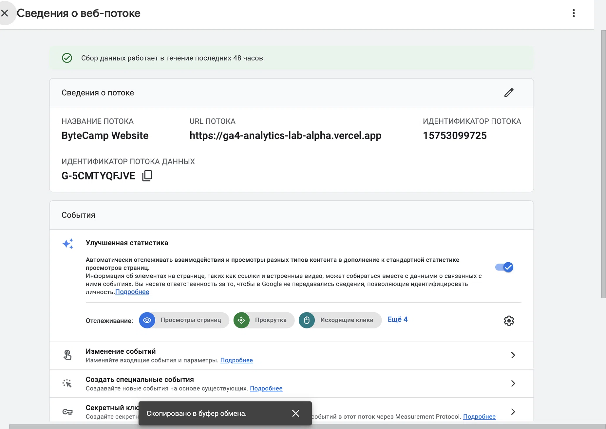
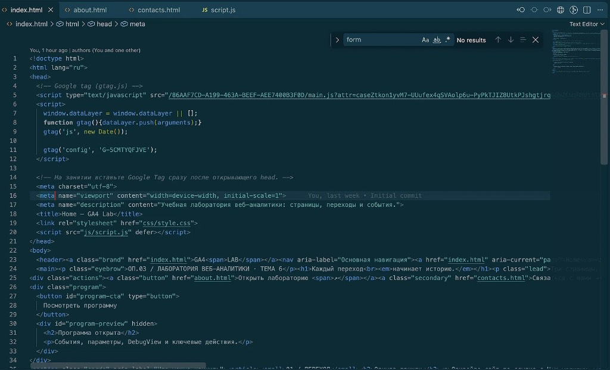
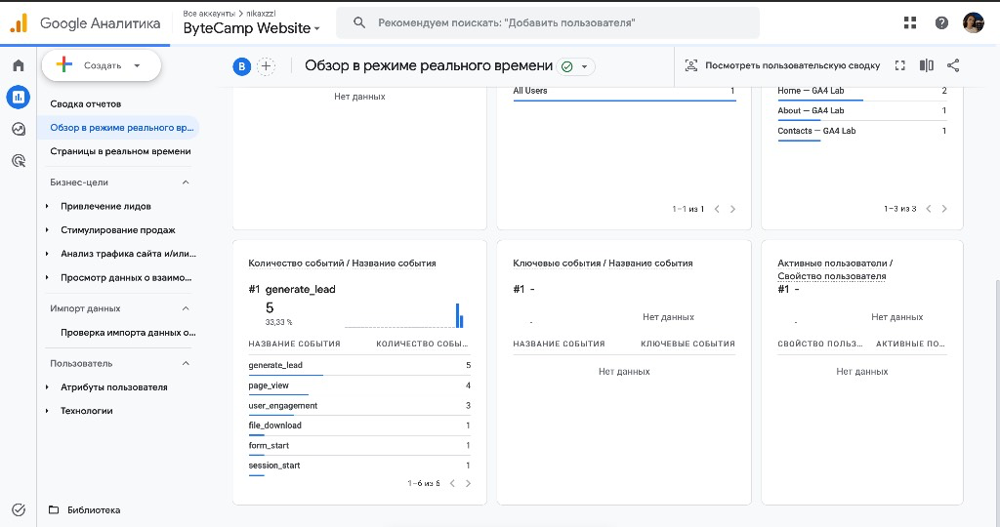
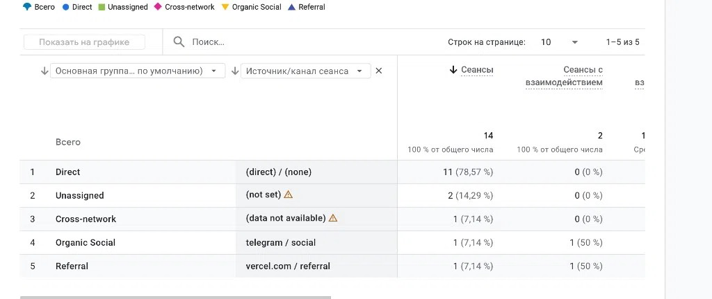
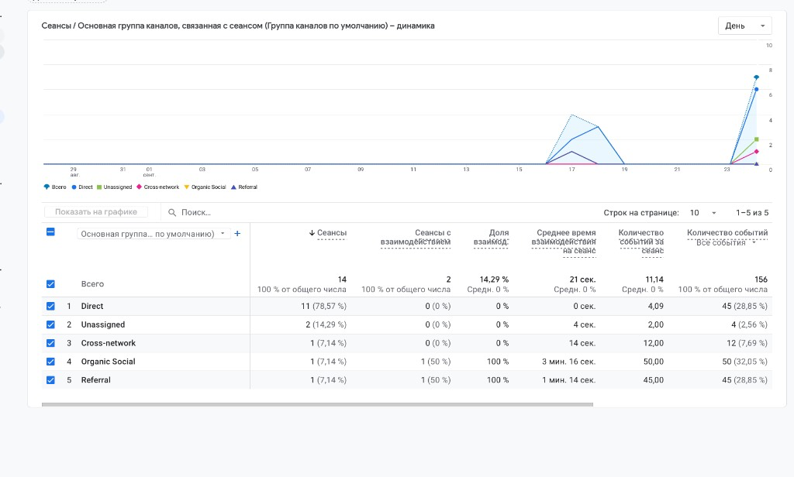

# Домашнее задание №3: Тег на сайте, источник и отчёты GA4

| № | Что доказано | Где это видно (ссылка на скриншот) |
| :-: | :--- | :--- |
| **1.** | Google Tag установлен на сайт |  |
| **2.** | Тег есть в коде страницы |  |
| **3.** | Аналитика получает события с сайтаа |  |
| **4.** | по UTM определяется источник перехода |  |
| **5.** | Статистика за период |  |
