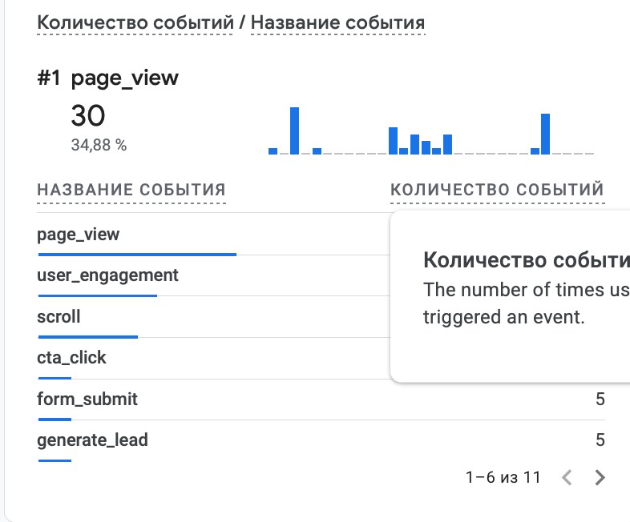
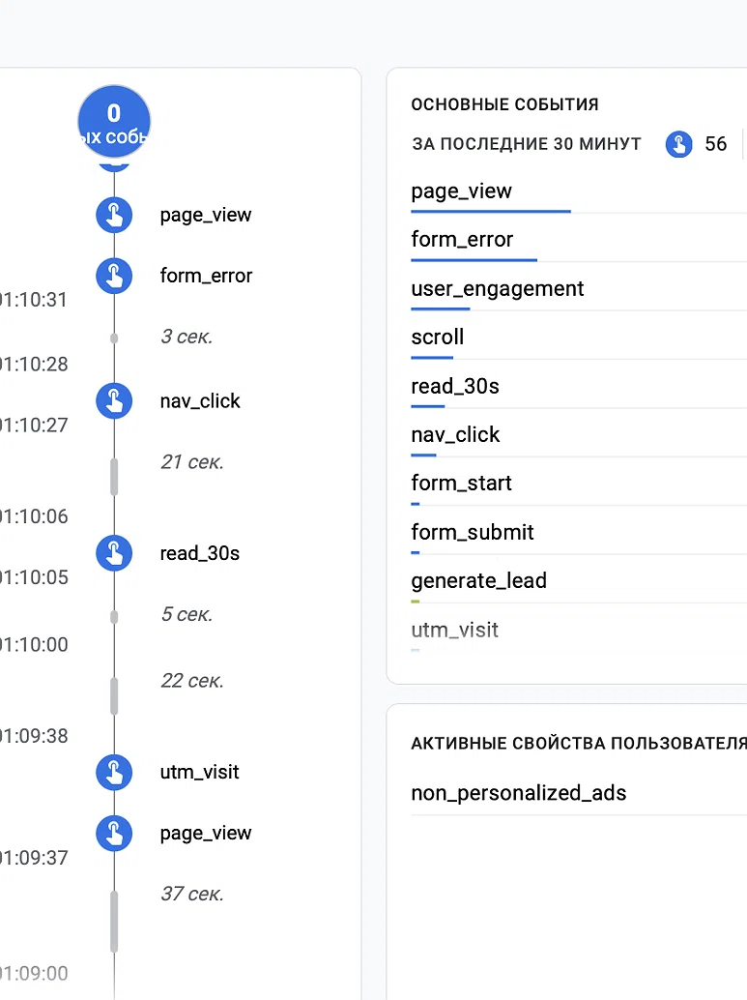
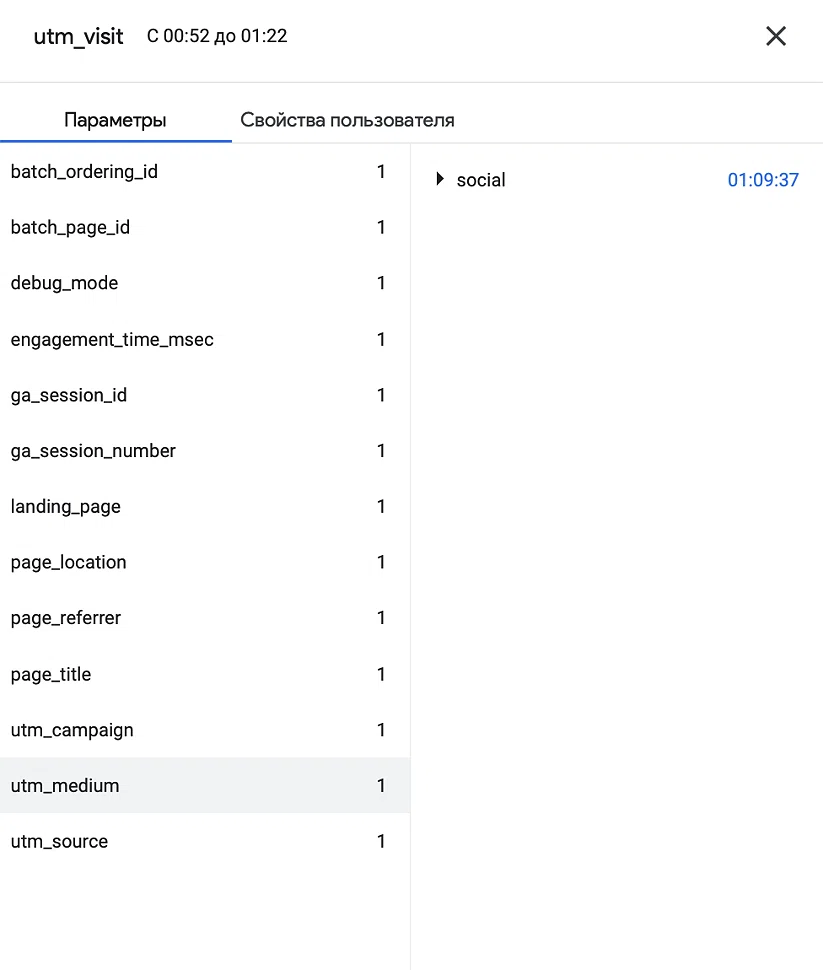
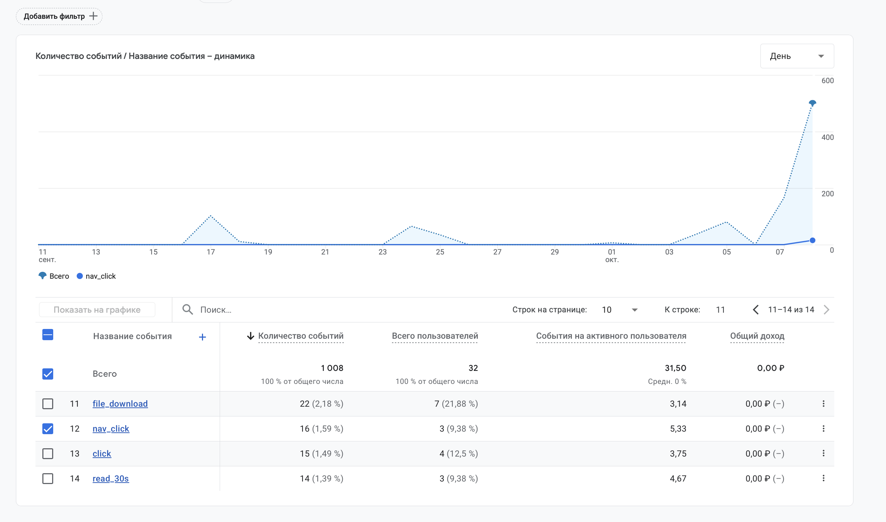

# Домашняя работа № 4 · Свои события и параметры в GA4

**Дисциплина:** ОП.03 «Информационные технологии»

| Поле | Значение |
|---|---|
| Фамилия, имя, отчество |  Кононова Ника Антоновна|
| Группа |  РПО3 |
| Номер работы | 4 |
| Тема работы | Свои события и параметры: четыре метрики на сайте |
| Дата сдачи |  |
| Ветка | `hw-04` |

---

## 1. Мой сайт и мой ресурс

| Поле | Значение |
|---|---|
| Публичный адрес сайта | https://ga4-analytics-fb6o82e4t-nikaxzzl.vercel.app |
| Measurement ID (`G-5CMTYQFJVE`) |  |
| Коммит с метриками (ссылка или первые 7 символов) | 3228135 metrics |
| Статус публикации | READY |
| Страницы, где подключён `js/metrics.js` | index.html, about.html, contacts.html |

Файл подключается после основного скрипта и на каждой странице по одному
разу: два подключения дают двойные события.

## 2. Какие метрики добавлены

| Событие | Что измеряет | Что делали, чтобы оно сработало |
|---|---|---|
| `nav_click` | клики по пунктам меню | Нажимали на ссылки в навигационном меню сайта. |
| `utm_visit` | метки кампании из адреса | Переходили по тестовой ссылке с UTM-параметрами |
| `read_30s` | полминуты на странице | Находились на одной странице сайта 30 сек |
| `form_error` | форма не прошла проверку браузера | Отправляли форму с незаполненными обязательными полями |

Скриншот: вставьте строку 

## 3. События в DebugView

| Поле | Значение |
|---|---|
| Дата и время проверки | 08.10.2026, 00.18 |
| Как подключали отладку | Tag Assistant / `debug_mode` |
| Какие из четырёх событий пришли | nav_click, utm_visit, read_30s, form_error |
| Какие не пришли и почему |  |

Скриншот: вставьте строку 

## 4. Параметры события `utm_visit`

**Ссылка, по которой открывали сайт:**

```
https://ga4-analytics-lab-alpha.vercel.app/?utm_source=telegram&utm_medium=social&utm_campaign=ga4_lab
```

| Параметр | Значение в ссылке | Значение в GA4 |
|---|---|---|
| `utm_source` | telegram | telegram |
| `utm_medium` | social | social |
| `utm_campaign` | ga4_lab | ga4_lab |
| `landing_page` | — | / |

Скриншот: вставьте строку 

Если значение в GA4 отличается от значения в ссылке, напишите, в чём разница
и почему так вышло.

>

## 5. Событие вне отладки

| Поле | Значение |
|---|---|
| Где проверяли | Realtime / Отчёты → Взаимодействие → События |
| Какое событие искали | nav_click |
| Сколько срабатываний показал экран | 16 |
| Период (для отчёта) | 16 сентебря - 08 октября |

Скриншот: вставьте строку 

## 6. Что эти метрики показывают про сайт

Два-три предложения: что вы узнали о поведении посетителей из четырёх
новых событий. Например, по каким пунктам меню ходят чаще, доходит ли
кто-то до получаса чтения, спотыкается ли форма.
<Благодаря новым событиям можно понять, как посетитель ведёт себя на сайте. По nav_click видно, что человек пользовался навигационным меню, по utm_visit — откуда он пришёл по UTM-меткам; по read_30s — что он задержался на странице дольше 30 секунд; а form_error показывает, что кто-то пытался отправить форму с незаполненными полями. Данные метрики помогают собрать информацию и улучшить сайт  >
>

## 7. Что не получилось

Если какая-то метрика не заработала, напишите какая, что показывал экран
и что было проверено по таблице из `README.md`. Незаполненный раздел
означает, что всё получилось.

>

## 8. Использование ИИ

Скрипты метрик выданы готовыми. Подключение, проверку и кадры вы делаете
сами. ИИ допускается для формулировок и оформления.

| Вопрос | Ответ |
|---|---|
| Что сделано самостоятельно | Задания |
| Что спрошено у модели | Почему не приходила utm_visit |
| Что после этого изменено | изменила в коде страку т. к. там не хватало |